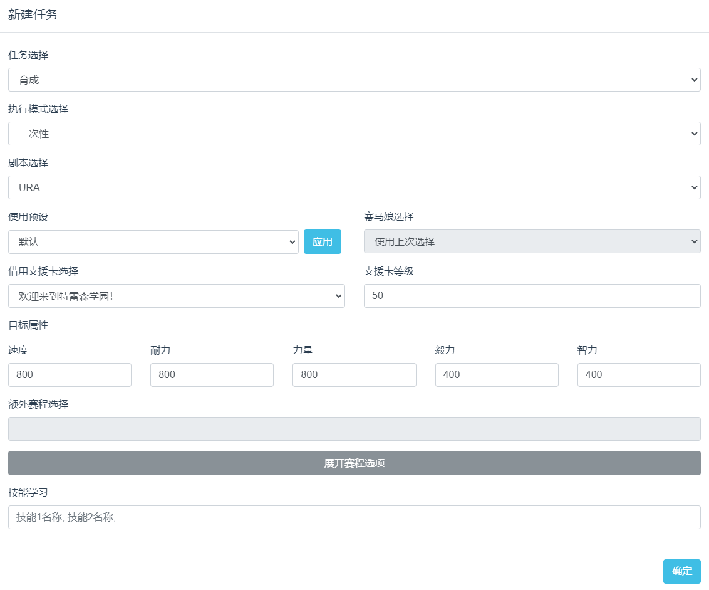

# UmamusumeAutoTrainer

闪耀！优俊少女（赛马娘国服）自动育成工具

## 功能

1. 支持所有马娘自动完成育成剧本
2. 自定义育成目标属性，跑法，额外赛程，学习技能，用于更轻松的刷三星因子和提高马娘继承相性 \


## 使用说明

### 1. 下载

#### 方式A. 使用git
#####  克隆仓库

```commandline
git clone https://github.com/shiokaze/UmamusumeAutoTrainer
```
##### 安装依赖

建议使用python3.10.9

```commandline
pip install -r requirements.txt
```
#### 方式B. 下载一键包
在[release页面](https://github.com/shiokaze/UmamusumeAutoTrainer/releases)下载最新zip文件并解压 

### 2. 配置

修改config.yaml文件内容

```
bot:
  auto:
    adb:
      device_name: "127.0.0.1:16384" # 改为模拟器的adb端口
      delay: 0
    cpu_alloc: 4 # 分配的cpu数量
```
常见模拟器的端口：\
（推荐使用）mumu12: 127.0.0.1:16384 \
雷电/蓝叠模拟器: emulator-5554

### 3. 模拟器设置

设置模拟器分辨率为720 * 1280, dpi 180（竖屏）

### 4. 启动

```
py main.py
```

如果使用一键包，双击运行run.ps1即可。如果打开是记事本，右键文件打开方式选择powershell运行

控制台显示以下内容即为启动成功
```commandline
UAT running on http://127.0.0.1:8071
```

复制到浏览器访问即可通过webui配置任务并启动脚本



## 注意事项

1. 如果马娘育成阶段中包含了自选赛事或xxx粉丝数量要求的比赛（如小栗帽第三年的2场g1和乌拉拉的粉丝数目标等），需要使用对应马娘的预设或在自定义赛程中自行配置参加哪场比赛
2. 目标属性尽量与携带的支援卡类型比例匹配，不要带了例如3智3速又设置了很高的耐力和力量目标
3. 暂时不支持选择育成马娘和种马，启动时会使用游戏内保存的上次育成的马娘和种马，如果没有保存记录，先手动选择完成后在启动
4. 不推荐携带友人卡，因为暂时没有对友人卡出行写特定策略，所以效果不如带其他类型支援卡
5. 启动脚本时应处于主菜单或者任意育成界面

### 如果出现异常

1. 如果出现了模拟器连接失败，connection reset等错误，关闭正在运行的加速器(如uu加速器)并使用任务管理器关闭adb.exe后重启模拟器以及脚本程序
2. 如果出现了识别错误导致程序报错、进入了预期之外的界面、或者卡在某一界面不动的情况下，人工操作进入下一回合并在webui内重置任务再启动即可。可以保存一下卡住的界面截图并附上报错日志提issue。


